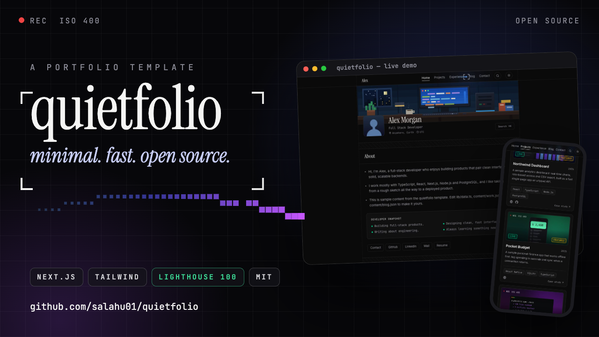

# quietfolio-showcase

Two things live here — one repo, two branches:

| Branch | Serves | URL |
| --- | --- | --- |
| `main` | **Showcase source** — a dynamic, motion-graphical showcase for [quietfolio](https://github.com/salahu01/quietfolio), doubling as a motion-design résumé | served at **https://salahu01.github.io/quietfolio/** (from the `showcase` branch of the `quietfolio` repo) |
| `gh-pages` | **Template sample demo** — the quietfolio template's built static export (Alex Morgan sample content) | served at **https://salahu01.github.io/quietfolio-showcase/** |

## The showcase (`main`)

A single static page: `index.html` with inline CSS and JS, GSAP from cdnjs, and the 23.5 s launch film in `media/`. No build step. Quietfolio's own design language throughout: zinc monochrome (`#0a0a0a` / `#f5f5f4`), Inter + Instrument Serif + JetBrains Mono, stripe dividers, cursor spotlight cards, blue/ember glows.

- Template source: [salahu01/quietfolio](https://github.com/salahu01/quietfolio) · sample demo: [salahu01.github.io/quietfolio-showcase](https://salahu01.github.io/quietfolio-showcase/)
- Film source: `motion-graphics/quietfolio-launch` (scene.html `render(t)` + synthesized score)
- Sister sites: [Globber](https://salahu01.github.io/Globber/) · [LiveWall](https://salahu01.github.io/livewall/)

### What's inside

| Section | What the visitor learns |
| --- | --- |
| Hero | Procedural pixel field, kinetic serif title, live HUD (T + FPS), theme toggle |
| Marquee | The numbers: 23.5 s film, Lighthouse 100s, 0 backend, −14 LUFS, MIT |
| 01 / The film | Embedded `media/reel.mp4` with 7 clickable chapters that scrub the video |
| 02 / The craft | Horizontal-scroll cards, each with a **live canvas demo** (waveform, cursor/reticle, audio bars, pixel wipe) + the `npm run build` pipeline |
| 03 / Inside quietfolio | 6 feature cards + a working port of the home-page project filters |
| 04 / Proof | Animated Lighthouse rings, JSON-LD/CSP notes, working **⌘K palette** miniature, circular theme-reveal demo |
| 05 / Content → ship | Content model table (`lib/data.ts`, `content/*.json`, `public/img/`), 4-tab terminal (Pages / Check / Film / Make-it-yours), animated counters |
| 06 / The human | Sample timeline, stack groups, links to Globber + LiveWall |
| Footer | Giant serif type, star-on-GitHub CTA |

### Preview locally

```sh
python3 -m http.server 8000   # then open http://localhost:8000
```

Press <kbd>⌘K</kbd> / <kbd>Ctrl+K</kbd> anywhere to try the palette. Toggle the theme in the hero.

### How it deploys

The showcase files on `main` are mirrored to the `showcase` branch of [salahu01/quietfolio](https://github.com/salahu01/quietfolio), which GitHub Pages serves at **https://salahu01.github.io/quietfolio/**:

```sh
git push origin main   # source of truth
# then mirror to the quietfolio repo's showcase branch (see below)
```

## The sample demo (`gh-pages`)

Built from the [quietfolio](https://github.com/salahu01/quietfolio) template with a different base path — **never hand-edit** this branch, rebuild it:

```sh
git clone github.com:salahu01/quietfolio.git /tmp/qf-repo && cd /tmp/qf-repo
npm install   # Node 22 (.nvmrc)
rm -rf out .next
STATIC_EXPORT=1 NEXT_PUBLIC_BASE_PATH=/quietfolio-showcase \
  NEXT_PUBLIC_SITE_URL=https://salahu01.github.io/quietfolio-showcase \
  NEXT_PUBLIC_NOINDEX=1 npm run build
cd out && touch .nojekyll && git init -q -b gh-pages && git add -A \
  && git commit -qm "deploy: static export" \
  && git push -f git@github.com:salahu01/quietfolio-showcase.git gh-pages
```

## Licence

MIT, same as the template and the film. The film (`media/reel.mp4`, ~8 MB) is the LinkedIn upload copy — under the 100 MB file limit.
